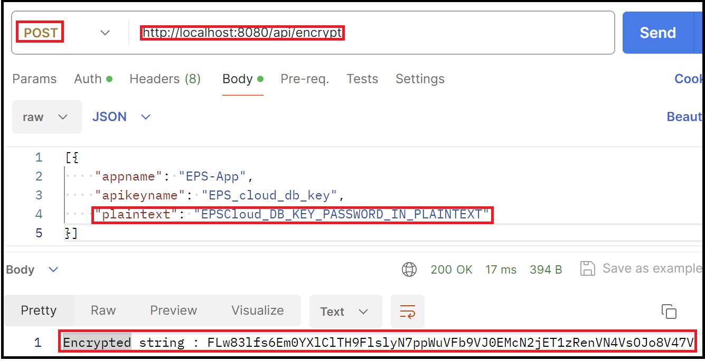
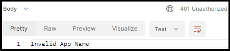
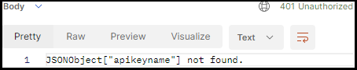

# API Encryption/Decryption

## Configuration

Lets start with creating config file and .sql file.

### application.properties file

1.Configure parameters in .properties file. (APIEncryptDecrypt\src\main\resources\application.properties)
> [!NOTE]
> Plaintext password/ token key are advised to be stored in a secure location.

```
spring.datasource.url=jdbc:h2:mem:../testdb
spring.datasource.driverClassName=org.h2.Driver
spring.datasource.username=sa
# Advised to store plaintext password in a secure location
spring.datasource.password=asdasd
spring.jpa.show-sql=true
spring.jpa.properties.hibernate.dialect=org.hibernate.dialect.H2Dialect
spring.jpa.hibernate.ddl-auto= update
spring.h2.console.enabled=true
# default path: h2-console
spring.h2.console.path=/h2-ui
#==========================================
# Advised to store key in a secure location
encryption.key=I626TbPLvu7tcxk330esD4BmDJDktGme+Jr2ytbkuAE=
```

### data.sql file

1. Configure query file to auto create fields in H2 database. (APIEncryptDecrypt\src\main\resources\data.sql)

```
--Dummy APIoken for testing purpose
CREATE TABLE APP (ID INT PRIMARY KEY, APPNAME VARCHAR(255), APIKEYNAME VARCHAR(255), APITOKEN VARCHAR(255));
INSERT INTO APP VALUES (1, 'app1', 'app1_db_key' ,'RZPO9EMzSkbw4hk');
INSERT INTO APP VALUES (2, 'EPS-App', 'EPS_cloud_db_key','nLZg5i1E29cipjz');
INSERT INTO APP VALUES (3, 'AutomationERP', 'ERP_db_key','6w41UNXcJowKRAJ');
```

## How to use

### Encryption
Step 1. To encrypt a plain text, please ensure that the following fields are created in H2 Database:
- Application Name
- Application Key Name 
- API Key 

Step 2. POST > http://localhost:8080/api/encrypt.

Step 3. Add X-API-key to header. (API key from above configuration)


Step 4. Copy paste the following request body (ContentType : application/json) similar to below: 
```
[{
    "appname": "EPS-App",
    "apikeyname": "EPS_cloud_db_key",
    "plaintext": "EPSCloud_DB_KEY_PASSWORD_IN_PLAINTEXT"
}]
```

[Optional] Using curl to encrypt.
```
curl --location 'http://localhost:8080/api/encrypt' \
--header 'Content-Type: application/json' \
--header 'x-api-key: nLZg5i1E29cipjz' \
--data '[{
    "appname": "EPS-App",
    "apikeyname": "EPS_cloud_db_key",
    "plaintext": "EPSCloud_DB_KEY_PASSWORD_IN_PLAINTEXT"
}]'
```
Exepected Result



Error Handling: 

| Status Code  | Response Message |
| ------------- | ------------- |
| 401 (Unauthorized) | Invalid API Key Name |
| 401 (Unauthorized) | Invalid App Name |
| 401 (Unauthorized) | Invalid API Key |
| 401 (Unauthorized) | JSONObject["apikeyname"] not found |

### Decryption

Step 1. To decrypt a cipher text, please ensure that the following fields are created in H2 Database:
- Application Name
- Application Key Name 
- API Key  

Step 2. POST > http://localhost:8080/api/decrypt. Ensure that request header is using (Authorization Type) API key 

Step 3. Add X-API-key to header. (API key from above configuration)


Step 4. Copy paste the following request body (ContentType : application/json) similar to below: 
```
[{
    "appname": "EPS-App",
    "apikeyname": "EPS_cloud_db_key",
    "ciphertext": "EPSCloud_DB_KEY_PASSWORD_IN_PLAINTEXT"
}]
```
[Optional] Using curl to decrypt.
```
curl --location 'http://localhost:8080/api/decrypt' \
--header 'Content-Type: application/json' \
--header 'x-api-key: nLZg5i1E29cipjz' \
--data '[{
    "appname": "EPS-App",
    "apikeyname": "EPS_cloud_db_key",
    "ciphertext": "FLw83lfs6Em0YXlClTH9FlslyN7ppWuVFb9VJ0EMcN2jET1zRenVN4VsOJo8V47V"
}]'
```


## Error Handling

| Status Code  | Response Message | 
| ------------- | ------------- |
| 401 (Unauthorized) | Invalid API Key Name |
| 401 (Unauthorized) | Invalid App Name| 
| 401 (Unauthorized) | Invalid API Key |
| 401 (Unauthorized) | JSONObject["apikeyname"] not found |







## Limitation

 - IV is declared as global variable and stored in the memory. Encrypted string will not be able to be decrypted if API server is restarted 